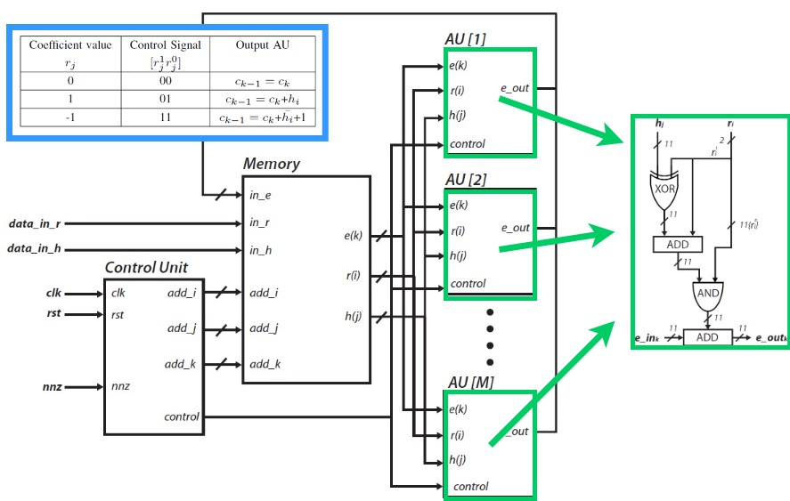
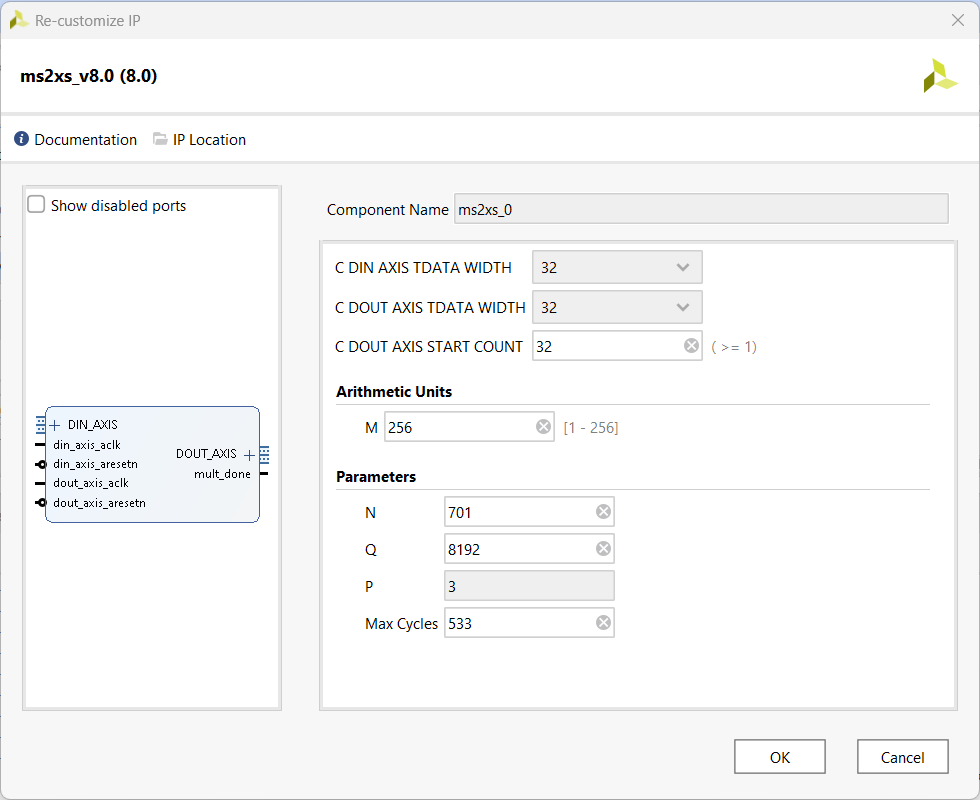
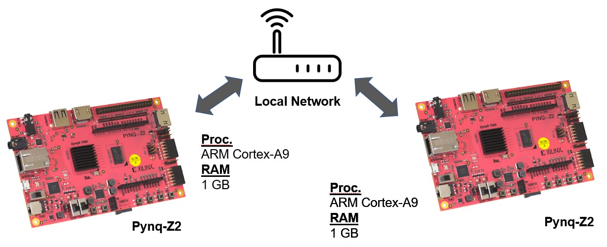

# HMAC: PoC

2024-03-06 - Eros Camacho-Ruiz (camacho@imse-cnm.csic.es)

This is the repository of the one of the Proof-of-Concepts presented in the [PhD Dissertation](https://github.com/ErosCamacho/PhD_Dissertation/blob/main/PhD_Thesis_Eros_Camacho_Ruiz_vFinal_rev.pdf) entitled: <b>"Design of a hardware Root-of-Trust on embedded systems"</b>

The main idea of this repository is:
- The use of a HW RoT proposed in dissertation with the combination of several modules. 
- Define a demo in which it is possible to provide a message verification through HMAC (FIPS 198-1)

*Note: All the content of this repository has been implemented using the Pynq Framework.*

<!-- TABLE OF CONTENTS -->
## Table of Contents
  <ol>
    <li><a href="#dir-struc">Directory structure</a></li>
    <li><a href="#ip-integ">IP Integration</a></li>
    <li><a href="#pre-pynqz2">Prerequisites for the Pynq-Z2 platform</a></li>
    <li><a href="#ins-test">Installation and Use of the Test</a></li>
	<li><a href="#ins-demo">Installation and Use of the Demo</a></li>
	<li><a href="#example">Example of the Demo</a></li>
    <li><a href="#note">Note for version</a></li>
    <li><a href="#contact">Contact</a></li>
	<li><a href="#developers">Developers</a></li>
  </ol>

## Directory structure <a name="dir-struc"></a>

- RoT: the folder that contains the RoT developed in the dissertation
	- puf: it contains all the files related with the puf/trng.
	- sha2: files related with sha-2 hw and sw implementations.
	- sha3: files related with sha-3 hw and sw implementations.
	- common: drivers and other funtions of the RoT.
	- RoT.bit: the bitstream of the RoT.
	- RoT.h: the headers of the funtions of the RoT.
	- config.h: the configure file. 
- HMAC.c: it contains the HMAC functions.
- HMAC.h: the headers of the HMAC functions. 
- demo.c: main file to demo
- README.md: this file 
. Makefile: to compile the demo

## HMAC operation <a name="dir-struc"></a>

There are many variants of HMAC, which are HMAC-SHA1, HMAC-SHA2, HMAC-MD5, that corresponds to the use of SHA-1, SHA2, and Message-Digest 5 (MD5) hash functions. 
Since there are many collisions attacks on SHA-1 and MD5 reported in the literature, they have been discarded to be used in this RoT. 
For that, the hash functions selected have been SHA-2 and SHA-3 to perform the HMAC function. 
Although SHA-3 is not recognized in FIPS 198-1 as hash function to use in HMAC, NIST expects to include it in the standard NIST SP 800-224 in the future. 

For the better understanding of the proposed implementation, the mathematical expression of the HMAC taken from FIPS 198-1 is provided:
    \begin{align}
    \operatorname{HMAC}(K, m) &= \operatorname{H}\Bigl(\bigl(K' \oplus opad\bigr) \parallel 
    \operatorname{H} \bigl(\left(K' \oplus ipad\right) \parallel m\bigr)\Bigr) 
    \label{eq:hmac_1}
    \\
    K' &= 
    \begin{cases}
    \operatorname{H}\left(K\right) & \text{if}\ K\text{ is larger than block size} \\
    K                              & \text{otherwise}
    \end{cases}
    \label{eq:hmac_2}
    \end{align}

    where
    \begin{itemize}
        \item $\operatorname{H}$ is the SHA-2 (256) cryptographic hash function.
        \item $m$ is the message to be authenticated.
        \item $K$ is the secret key.
        \item $K'$ is a block-sized key derived from the secret key, $K$; either by padding to the right with 0s up to the block size, or by hashing down to less than or equal to the block size first and then padding to the right with zeros.
        \item $\parallel$ denotes concatenation.
        \item $\oplus$ denotes bitwise exclusive or (XOR).
        \item $opad$ is the block-sized outer padding, consisting of repeated bytes valued $0x5c$.
        \item $ipad$ is the block-sized inner padding, consisting of repeated bytes valued $0x36$. 
    \end{itemize}

## IP Integration <a name="ip-integ"></a>

The IP module is delivered in the ```ntru_ms2xs_8.0``` folder. The design of the core part of the IP module is depicted in the next figure. The arithmetic unit (AU) is shown 
in the green box. The three different operation modes are ruled by the coefficients of the blind polynomial: -1,1 and 0. The parameter ```M``` is depicted as paralellization 
coefficient that means the number of AUs are working in parallel. 



The IP integration is finished adding an user interface in which it is possible to modify the next parameters of the polynomial multiplier:
- ```M```: is the number of AUs that are working in parallel.
- ```N```: the number of the coefficients of the polynomial. See NTRU documentation.
- ```Q```: is the number that symbolizes the modQ reduction in the polynomial ring. 
- ```max_cycles```: is the number of maximum cycles it is possible to accelerate the algorithm avoind timing attacks. See PhD Dissertation.



The next table shows all the implementations delivered in this repository. There are in total 8 different strategies: 4 parameters set in the NTRU where in each one the
`max_cycles` value was set in `N` and `CL` (Confident Limit). From each configuration there are different values of `M`: `1,2,3,4,5,6,7,8,9,10,11,12,13,14,15,16,32,64,128,256`.
That is basically the content of the folder `NTRU_3Round.rar\bit\`. As a final user, you can discard (and remove) other implementations and remake the embedded integration using the 
configuration more suitable for your interest. 

| Parameter set |  `N`  | `CL` |
| :------------ | --- | --- |
| `ntruhps2048509` | 509 | 400 |
| `ntruhps2048677` | 677 | 516 |
| `ntruhps2048821` | 821 | 625 |
| `ntruhrss2048701` | 701 | 533 |

For further information, see Chapter 4 of the [PhD Dissertation](https://github.com/ErosCamacho/PhD_Dissertation/blob/main/PhD_Thesis_Eros_Camacho_Ruiz_vFinal_rev.pdf)

## Prerequisites for the Pynq-Z2 platform <a name="pre-pynqz2"></a>

1. Download the PYNQ C-API from https://github.com/mesham/pynq_api

2. Then, issue ```make```. Once it is built, issue ```sudo make install```. 

## Installation and Use of the Test <a name="ins-test"></a>

1. For compilation of a specific test:

```bash
make Test_N_VALUE
```

where `N_VALUE` can be: `509, 677, 821, 701`. So, for example if the user wants to compile something related with the parameter set `ntruhps2048509`, 
they must issue: `make Test_509`

2. For the use, the program has different input variables:
	- `-h` : Show the help.
	- `-hh` : Show the extended help.
	- `-n` : Number of test to perform.
	- `-M` : Paralelization coefficient. *Note: For that there must be a bitstream in the folder `N/CL/M`.
	- `-y` : CL parameter.
	
	Also it includes options to debug different parts:
	- `-d` : debug level
	- `-c` : number of coefficients to show in the debug. *In order to avoid a data massification on the screen.* 
		- `0`: Minimize the print in window.
		- `1`: Show the time in each part of the algorithm.
		- `2`: Show the extended evaluation of time.
		- `3`: Show the coefficients of SW and HW.
		- `4`: Show the multiplication operation in SW.
		- `5`: Show the multiplication operation in HW.
		- `6`: Show the public key.
		- `7`: Show the seed and he coefficients of r and h.
		- `8`: Show the multiplication operation in SW 3 ROUND.
		- `9`: Show the cuphertext of 3 ROUND, LIBNTRU, HW.
		- `10`: Show the hash of rm.
		- `11`: ***ONLY FOR PERFORMING THE SEED ANALYSIS.*** It generates the file `r.txt` .

An example, if it is desired to performance 1000 tests on the `ntruhps2048509` parameter set, using a confident limit of 400 with a parallelization coefficient of 10, 
it has to be typed: `Test_509 -n 1000 -M 10 -y 400`

***To run the tests, it is necessary to set the root privileges***

## Installation and Use of the Demo <a name="ins-demo"></a>

The main idea of the Demo is to interconnect two devices and share information using PQC as the next figure shows. In this case, two Pynq platforms are interconnected 
in a local network. The two of them are going to generate the key pair (public and private keys). Then, one of them is going to recive the public key of the other one using 
this key to encapsulate a shared secret. Then the ciphertext generated (with the information of the shared secret) is sent to the other platform that will use the 
private key to decapsulate and extract the shared secret. 



1. For compilation of a specific demo:

```bash
make Demo_N_VALUE
```

where `N_VALUE` can be: `509, 677, 821, 701`. So, for example if the user wants to compile something related with the parameter set `ntruhps2048509`, 
they must issue: `make Demo_509`

2. For the use, the program has different input variables:
	- `-h` : Show the help.
	- `-k` : Key generation.
	- `-e` : Encapsulation. 
	- `-d` : Decapsulation.
	
	Also it includes verbose options:
	- `-v` : verbose level level
		- `1`: Show only functions.
		- `2`: Show intermediate results.
		- `3`: Show keys.

## Example of the Demo <a name="example"></a>

A demo video example can be seen in the next [link](https://saco.csic.es/index.php/s/Ze9GETKY7zzMJ23). 

For the example, two platforms will be used: #PLATFORM_1 and #PLATFORM_2. *It is recommended that the verbose level be 3 in order to see all the intermediate results.*

1. The first step is to perform the key generation in both platforms:
```bash
Demo_509 -k -v 3
```

2. The next step is to send the public key of the #PLATFORM_1 to the #PLATFORM_2:
```bash
send_pk.sh
```
*Note: the configuration set in `send_pk.sh` can be modified to the final user. It has been set to my personal set-up.*

3. The next step is to encapsulate the shared secret using the public key in the #PLATFORM_2.
```bash
Demo_509 -e -v 3
```

4. The next step is to send the ciphertext generated in the below step back to the #PLATFORM_1:
```bash
send_ct.sh
```
*Note: the configuration set in `send_ct.sh` can be modified to the final user. It has been set to my personal set-up.*

5. The next step is to recover the shared secret in the #PLATFORM_1 decapsulating:
```bash
Demo_509 -d -v 3
```

At the end, it will check that both platforms share the same secrets.

***To run the demo, it is necessary to set the root privileges***

## Note for version <a name="note"></a>
### v. 1.0

* Reordered the repository structure.
* Added a Readme file. 

## Contact <a name="contact"></a>

**Eros Camacho-Ruiz** - (camacho@imse-cnm.csic.es)

_Hardware Cryptography Researcher_ 

_Instituto de Microelectrónica de Sevilla (IMSE-CNM), CSIC, Universidad de Sevilla, Seville, Spain_

## Developers <a name="developers"></a>
Eros Camacho-Ruiz

_Instituto de Microelectrónica de Sevilla (IMSE-CNM), CSIC, Universidad de Sevilla, Seville, Spain_


