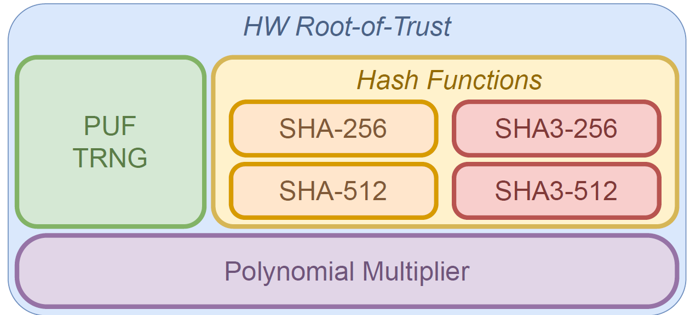
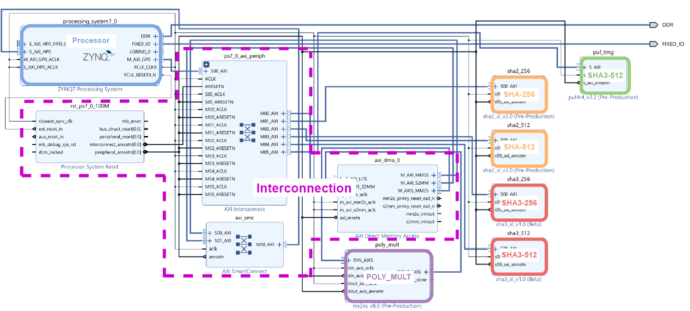
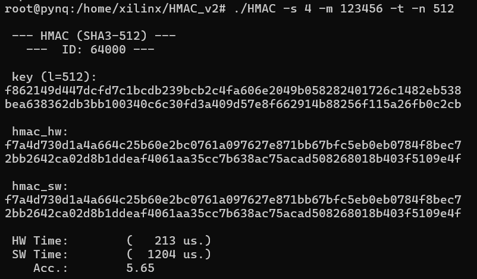

# HMAC: PoC

2024-03-06 - Eros Camacho-Ruiz (camacho@imse-cnm.csic.es)

This is the repository of the one of the Proof-of-Concepts presented in the [PhD Dissertation](https://github.com/ErosCamacho/PhD_Dissertation/blob/main/PhD_Thesis_Eros_Camacho_Ruiz_vFinal_rev.pdf) entitled: <b>"Design of a hardware Root-of-Trust on embedded systems"</b>

The main idea of this repository is:
- The use of a HW RoT proposed in dissertation with the combination of several modules. 
- Define a demo in which it is possible to provide a message verification through HMAC (FIPS 198-1)

*Note: All the content of this repository has been implemented using the Pynq Framework.*

<!-- TABLE OF CONTENTS -->
## Table of Contents
  <ol>
    <li><a href="#dir-struc">Directory structure</a></li>
    <li><a href="#hmac-ope">HMAC operation</a></li>
	<li><a href="#rot-integ">RoT Integration</a></li>
    <li><a href="#pre-pynqz2">Prerequisites for the Pynq-Z2 platform</a></li>
	<li><a href="#ins-demo">Installation and Use of the Demo</a></li>
	<li><a href="#example">Example of the Demo</a></li>
    <li><a href="#note">Note for version</a></li>
    <li><a href="#contact">Contact</a></li>
	<li><a href="#developers">Developers</a></li>
  </ol>

## Directory structure <a name="dir-struc"></a>

- RoT: the folder that contains the RoT developed in the dissertation
	- puf: it contains all the files related with the puf/trng.
	- sha2: files related with sha-2 hw and sw implementations.
	- sha3: files related with sha-3 hw and sw implementations.
	- common: drivers and other funtions of the RoT.
	- RoT.bit: the bitstream of the RoT.
	- RoT.h: the headers of the funtions of the RoT.
	- config.h: the configure file. 
- HMAC.c: it contains the HMAC functions.
- HMAC.h: the headers of the HMAC functions. 
- demo.c: main file to demo
- README.md: this file 
. Makefile: to compile the demo

## HMAC operation <a name="hmac-ope"></a>

There are many variants of HMAC, which are HMAC-SHA1, HMAC-SHA2, HMAC-MD5, that corresponds to the use of SHA-1, SHA2, and Message-Digest 5 (MD5) hash functions. 
Since there are many collisions attacks on SHA-1 and MD5 reported in the literature, they have been discarded to be used in this RoT. 
For that, the hash functions selected have been SHA-2 and SHA-3 to perform the HMAC function. 
Although SHA-3 is not recognized in FIPS 198-1 as hash function to use in HMAC, NIST expects to include it in the standard NIST SP 800-224 in the future. 

For the better understanding of the proposed implementation, the mathematical expression of the HMAC taken from FIPS 198-1 is provided:
    
```math
HMAC(K, m) = H\Bigl(\bigl(K' \oplus opad\bigr) \parallel 
H \bigl(\left(K' \oplus ipad\right) \parallel m\bigr)\Bigr) 
```

where

```math
K' = 
    \begin{cases}
    H\left(K\right) & \text{if}\ K\text{ is larger than block size} \\
    K                              & \text{otherwise}
    \end{cases}
```

where
- $H$ is the cryptographic hash function.
- $m$ is the message to be authenticated.
- $K$ is the secret key.
- $K'$ is a block-sized key derived from the secret key, $K$; either by padding to the right with 0s up to the block size, or by hashing down to less than or equal to the block size first and then padding to the right with zeros.
- $\parallel$ denotes concatenation.
- $\oplus$ denotes bitwise exclusive or (XOR).
- $opad$ is the block-sized outer padding, consisting of repeated bytes valued $0x5c$.
- $ipad$ is the block-sized inner padding, consisting of repeated bytes valued $0x36$. 

## RoT Integration <a name="rot-integ"></a>

The RoT is based on several building blocks that are part of many cryptographic algorithms and protocols, 
to that end, they are fundamental elements that can be used in various scenarios. Those building blocks are: 

    - **PUF/TRNG**: The significance of PUFs and TRNGs in cryptography necessitates their inclusion in the RoT. 
    - **Hash Function**: The RoT incorporates widely used hash functions in cryptographic implementations. These include SHA-2 based functions (SHA-256 and SHA-512) and SHA-3 based functions (SHA3-256 and SHA3-512).
    - **Polynomial Multiplier**: The inclusion of this module has resulted in a substantial performance enhancement in the domain of PQC, particularly within the NTRU algorithm.

The schematic of the RoT building blocks integration is the next one:



The embedded integration is the next one:



And the resources occupancy is depicted in the next table:

| Module | LUTs | FFs | BRAMs |
| -------------------------- | ----- | ----- | --- |
| Processor | 24 | 0 | 0 |
| Interconnection | 4095 | 5688 | 2.5 |
| SHA-256 | 1612 | 1196 | 0.5 |
| SHA-512 | 3192 | 2097 | 1 |
| SHA3-256 | 3859 | 3046 | 0 |
| SHA3-512 | 3618 | 2532 | 0 |
| NTRU Polynomial Multiplier | 359 | 130 | 4.5 |
| PUF / TRNG | 367 | 390 | 0 |
| **Total** | 17126 | 15079 | 8.5 |

For further information, see Chapter 5 of the [PhD Dissertation](https://github.com/ErosCamacho/PhD_Dissertation/blob/main/PhD_Thesis_Eros_Camacho_Ruiz_vFinal_rev.pdf)

## Prerequisites for the Pynq-Z2 platform <a name="pre-pynqz2"></a>

1. Download the PYNQ C-API from https://github.com/mesham/pynq_api

2. Then, issue ```make```. Once it is built, issue ```sudo make install```. 

## Installation and Use of the Demo <a name="ins-demo"></a>

The main idea of the Demo is to verify some message. The message should be given by prompt screen and in hex format. 
The key of this HMAC can be generated using the PUF (in this case the ID is working as key), 
using the TRNG (the key will be different in each generation) or
using the propmt to input a certain key in hex format

1. For compilation:

```bash
make HMAC
```

2. For the use, the program has different input variables:
	- `-h` : Show the help.
	- `-s` : Different version of the hash function: 1. SHA-256  --- 2. SHA-512 --- 3. SHA3-256 --- 4. SHA3-512.
	- `-m` : Input message (HEX format). 
	- `-p/t` : Generate a key using PUF(p) / TRNG(t) response.
	- `-n` : Number of bits of the generated key (max: 512)
	
	Also it includes verbose options:
	- `-v` : verbose level in which it is possible to check intermediate results. 

## Example of the Demo <a name="example"></a>

For the example, it is going to be generated the HMAC (SHA3-512) of the message (0x123456) with a key of 512 bits generated by the TRNG.

For that, we should type:
```bash
./HMAC -s 4 -m 123456 -t -n 512
```

The next image shows the result of the execution. As you can see both, SW and HW HMAC, return the same value.



***To run the demo, it is necessary to set the root privileges***

## Note for version <a name="note"></a>
### v. 1.0

* Reordered the repository structure.
* Added a Readme file. 

## Contact <a name="contact"></a>

**Eros Camacho-Ruiz** - (camacho@imse-cnm.csic.es)

_Hardware Cryptography Researcher_ 

_Instituto de Microelectrónica de Sevilla (IMSE-CNM), CSIC, Universidad de Sevilla, Seville, Spain_

## Developers <a name="developers"></a>
Eros Camacho-Ruiz

_Instituto de Microelectrónica de Sevilla (IMSE-CNM), CSIC, Universidad de Sevilla, Seville, Spain_


